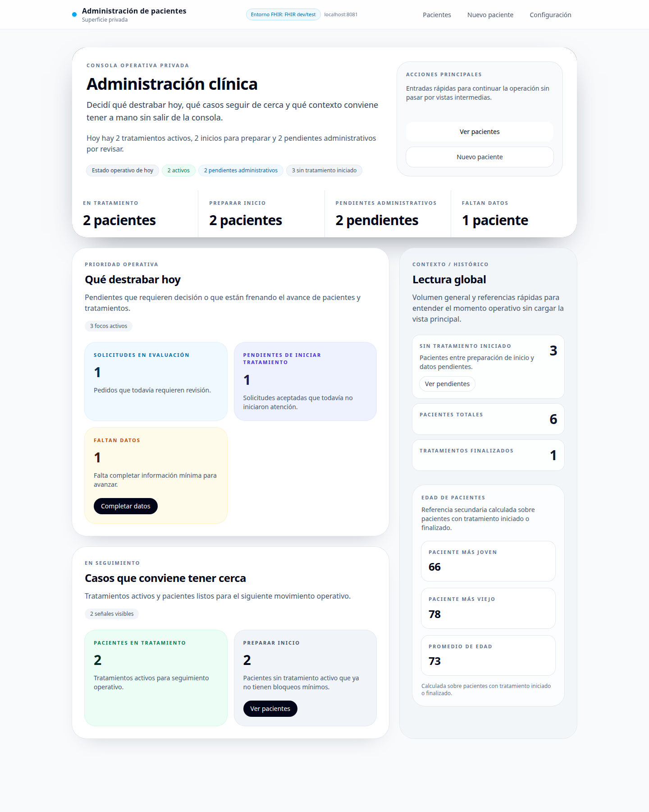
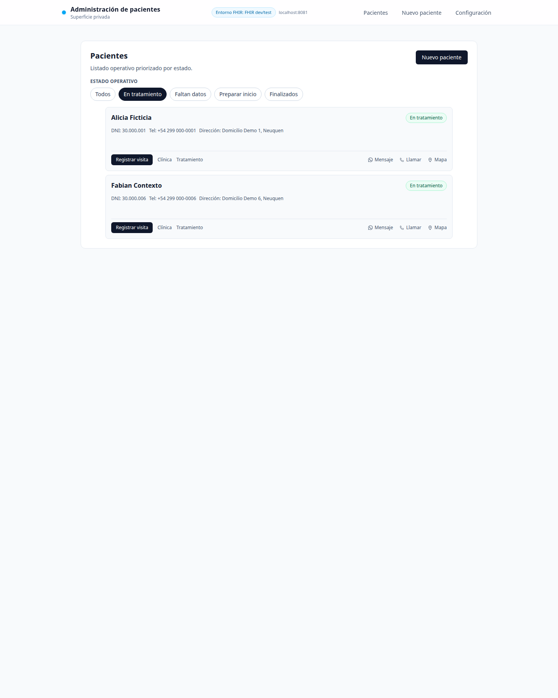
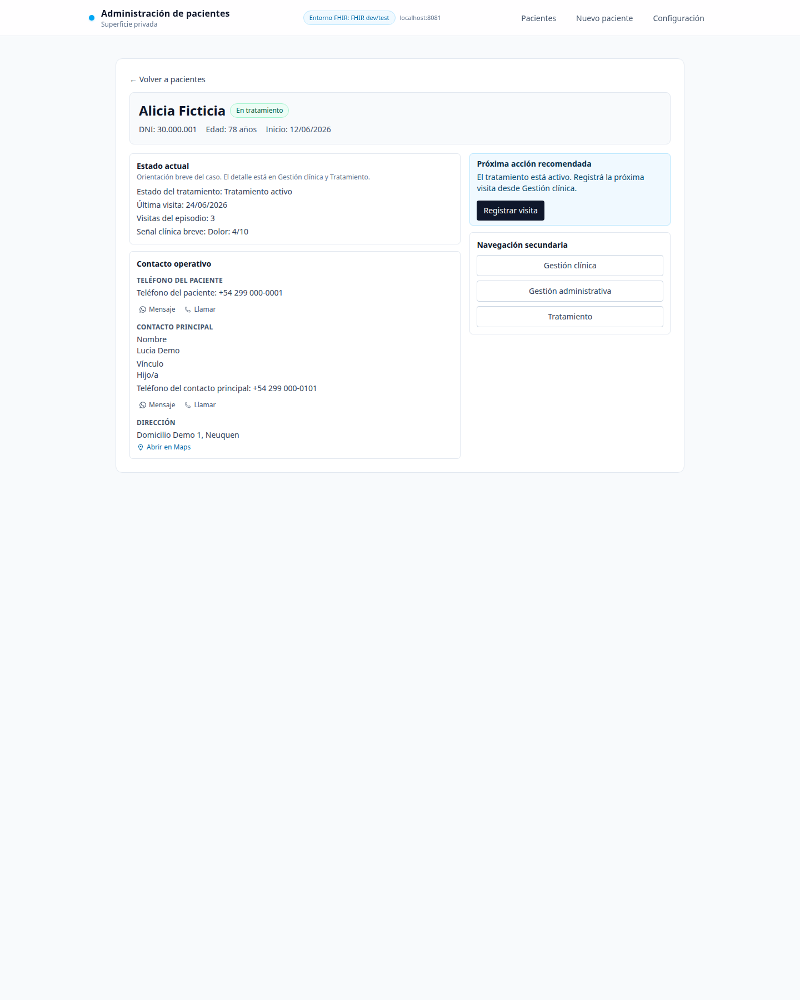
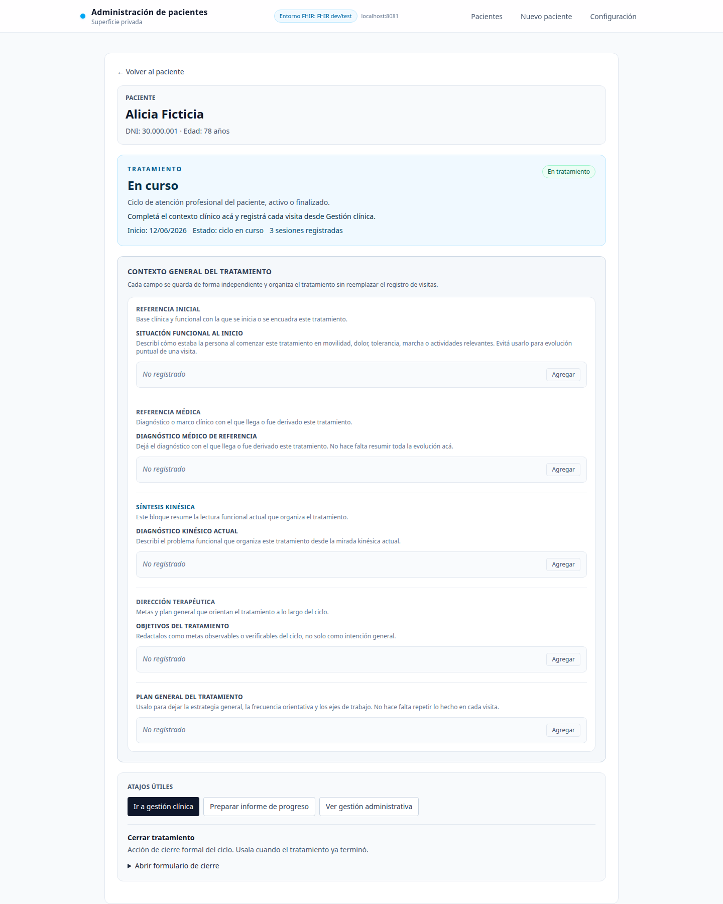
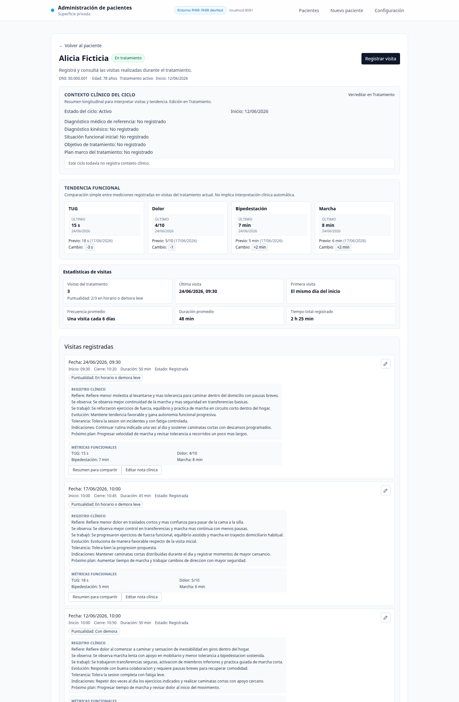

# Kinesiología a Domicilio

Real-world HealthTech case study built from professional home-care physiotherapy experience: a public patient acquisition site plus a local private clinical workflow modeled with pragmatic FHIR R4 concepts.

## Demo

- Public site: https://kinesiologiaadomicilio.vercel.app
- Private clinical workflow: `/admin` runs locally against HAPI FHIR and is shown here through sanitized screenshots.
- `/admin` is not a production deployment, not a public editable demo, and does not use a mock/demo mode today.

## Context

This project was built from an operational healthcare context, not from a generic SaaS template. It translates real home-care physiotherapy experience into a small but coherent digital product: a public website to acquire and qualify demand, plus a minimal private workflow to manage patients, requests, treatment cycles, visits, and follow-up.

## Problem It Solves

Small healthcare services often operate across fragmented channels: phone calls, WhatsApp, paper notes, and memory-driven coordination. This repo explores how to digitize that reality incrementally, from public demand capture to a private clinical-operational workflow, without pretending to be a full EHR.

## Product Scope

The product combines:

- a public acquisition site for home-based physiotherapy in Neuquen;
- WhatsApp-first contact and guided `/evaluar` orientation;
- a private `/admin` workflow for patients, requests, treatment cycles, visits, and functional follow-up;
- family-friendly visit summaries and professional signing configuration;
- SEO and analytics on the public side only.

## Why This Repo Is Professionally Relevant

This project is designed to demonstrate a profile that bridges healthcare operations, product thinking, clinical workflow analysis, pragmatic FHIR modeling, software implementation, and testing/documentation discipline.

It is especially relevant for roles such as:

- HealthTech / digital health product teams
- Implementation Analyst
- Clinical Systems Analyst
- Product Analyst (HealthTech)
- Junior Full Stack Developer with healthcare domain knowledge

## Stack

- Next.js 15 (App Router)
- React 19
- TypeScript
- Tailwind CSS 4
- Zod
- Vitest
- HAPI FHIR R4 integration for local/private workflow development
- Google Analytics 4 on public routes only

## Architecture

The repository keeps the public and private domains in the same codebase while separating responsibilities.

Read path:

`FHIR Server -> FHIR Client -> Repository -> Mapper -> Read model / loader -> UI`

Write path:

`UI Form -> Server Action -> Zod Schema -> Domain Rules -> Repository -> FHIR payload`

The UI does not work directly with raw FHIR resources. The app translates infrastructure data into route-level read models and keeps technical concerns away from the presentation layer.

## FHIR Modeling

The private workflow uses a deliberately small subset of FHIR R4:

- `Patient`: identity and administrative base
- `ServiceRequest`: incoming attention request / intake signal
- `EpisodeOfCare`: active or closed treatment cycle
- `Encounter`: home visit
- `Observation`: visit-level functional metrics
- `Condition`: reference medical diagnosis and kinesiologic diagnosis in the treatment context
- `Practitioner`: signing professional configuration

This is not presented as a full clinical record system. It is a constrained, incremental implementation oriented to operational usefulness.

## Testing And Quality

- Automated tests cover domain rules, mappers, repositories, route data loaders, metadata, and UI slices.
- The current repository snapshot includes 98 test files and 653 passing tests.
- Public/private separation is also reinforced through route structure and search-engine blocking for `/admin`.

Available checks:

```bash
npm run lint
npm run test
FHIR_BASE_URL=http://localhost:8081/fhir npm run build
npm run build:fhir-test
npm run build:fhir-real
```

Recommended default validation uses the disposable FHIR dev/test endpoint:

- `npm run build:fhir-test` for the usual safe build check
- `FHIR_BASE_URL=http://localhost:8081/fhir npm run build` when you want the explicit env-based equivalent

## Private Clinical Workflow Preview

Sanitized screenshots live in [docs/screenshots/README.md](./docs/screenshots/README.md).

The public landing is already deployed at https://kinesiologiaadomicilio.vercel.app, so this README links to the live site instead of duplicating landing screenshots here.

The private `/admin` surface works locally against HAPI FHIR and is shown here only through sanitized screenshots captured from the disposable dev/test endpoint (`http://localhost:8081/fhir`), not from the local-real `8080` environment.

There is no public editable demo for `/admin`. That surface remains local/private because it still depends on local infrastructure and must not be represented as an online sandbox.

All screenshots below use fictitious, sanitized data captured from the disposable local dev/test FHIR environment. No real patient data is shown.

### Admin Dashboard



Local private dashboard for daily clinical and administrative priorities.

### Patients List



Sanitized patient list showing treatment state, contact shortcuts, and operational navigation.

### Patient Detail



Local patient detail view with sanitized demographic, contact, and treatment context.

### Treatment Context



Treatment-cycle context modeled on top of FHIR resources, kept intentionally minimal and operational.

### Encounters And Follow-Up



Visit history and functional follow-up with fictitious clinical notes and demo metrics.

## Current Status

- Public website is deployable and portfolio-safe.
- Private clinical workflow is functional and meaningful, but remains local/private and intentionally minimal.
- The admin side should be read as a local clinical prototype/workflow surface, not as a production SaaS admin.
- This is not presented as a full EHR.
- `/admin` is intentionally private/local and not a public editable demo surface.
- Screenshots use fictitious/sanitized data from the local dev/test environment.
- Auth and multi-user concerns are intentionally out of scope at this stage.

Further technical documentation is available in [docs/README.md](./docs/README.md).

## Local Setup

To explore the private workflow locally:

```bash
npm install
npm run dev
```

`/admin` depends on a local HAPI FHIR server. Default scripts point to `http://localhost:8081/fhir` for disposable dev/test data, while `npm run dev:fhir-real` targets `http://localhost:8080/fhir` for local-real data.

Minimal environment notes:

- `FHIR_BASE_URL`: server-side only and required for the private workflow.
- `NEXT_PUBLIC_GA_ID`: optional, public analytics only.

## Key Takeaways

This repo is strongest when read as a case study in healthcare workflow digitization:

- not just a landing page;
- not a generic CRUD demo;
- not a full EHR claim;
- but a realistic bridge between public acquisition, care coordination, and minimal clinical operations.
