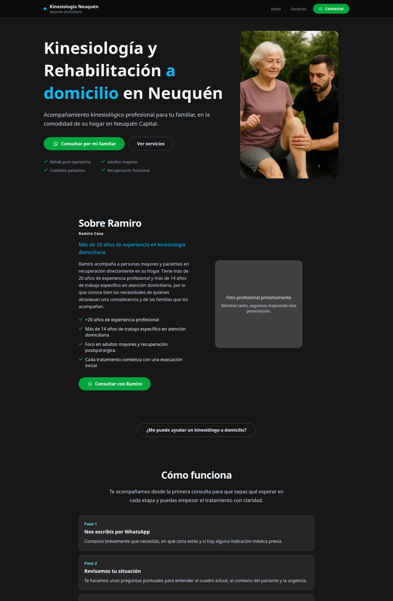

# Kinesiología a Domicilio

Public website for a home-care physiotherapy service in Neuquén, Argentina, and a case study in digitizing a real healthcare workflow.

## Public website

The landing page is deployed at [kinesiologiaadomicilio.vercel.app](https://kinesiologiaadomicilio.vercel.app/). It explains the service, guides prospective patients through an initial evaluation, and offers WhatsApp contact.



## Relationship to the clinical application

The private clinical application is being rebuilt separately in the `kinesiologia-clinica` repository. This repository continues to hold the public landing and retains code and historical material from the previous `/admin` workflow. That earlier admin is not the current clinical application and is not a public demo.

This README focuses on the public site. The clinical application's documentation is maintained with that project; this repository's internal documents provide historical and transition context where needed.

## Project context

The public site is part of a real-world healthcare workflow digitization project. The broader case study connects patient acquisition and orientation with a private clinical workflow, while keeping those surfaces distinct. It is relevant to HealthTech, clinical systems, implementation, product, and junior full-stack roles in healthcare.

## Public site scope

- Home-based physiotherapy information for Neuquén.
- Service descriptions and guided `/evaluar` orientation.
- WhatsApp contact with prefilled messages.
- Search metadata and Google Analytics 4 on public routes only.

## Stack

- Next.js 15 (App Router)
- React 19
- TypeScript
- Tailwind CSS 4
- Zod
- Vitest

## Local setup

```bash
npm install
npm run dev
```

The public site can be explored locally. The retained `/admin` code depends on a local HAPI FHIR server and belongs to the previous private workflow; it should not be treated as a public demo or as the current clinical application.

Environment variables used by this repository:

- `NEXT_PUBLIC_GA_ID`: optional; analytics for public routes only.
- `FHIR_BASE_URL`: server-side endpoint required by the retained private/admin workflow.

## Further documentation

- [Documentation index](./docs/README.md)
- [Repository separation plan](./docs/remodelacion/05-plan-separacion-repositorios.md)
